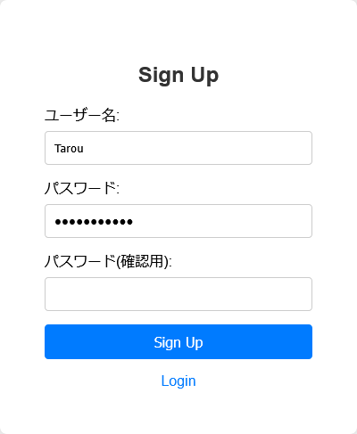
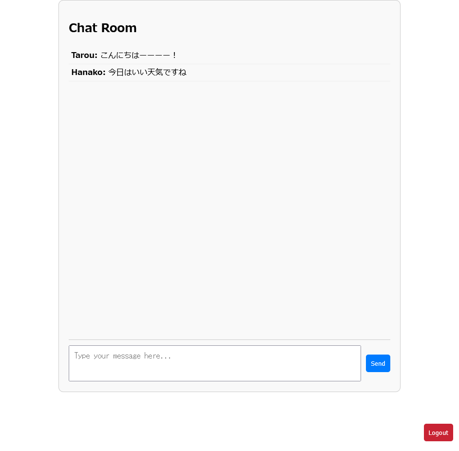

# Python Tasks

教えているときの題材用

## 動作環境

Python 3.12

## Task 1

for文、if文、Flagの考え方、アルゴリズムの復習では「素数判定プログラム」を作ろう

### 1-1, 要件

- 入力された整数が素数か素数じゃないか判定するプログラムの作成
- 入力をコントロール(エラーハンドリング)をしよう

### 1-2, ヒント

#### 1-2-1, プログラムの一部

```python
#素数判定プログラム

try:
    input_number = int(input("素数判定したい数値を入力してください:"))
except ValueError:
    print("整数を入力してください")
    exit()

if input_number == 1:
    # 入力が1のとき
elif input_number <= 0:
    # 例外処理
else:
    # 素数の判定をする処理
```

#### 1-2-2, ポイント

- 素数の特徴を考えよう

### 1-3, 解説

try - exceptの構文
構文

```python
try:
    # エラーが起こりそうな構文
except エラー as e:
    # eはエラー名を検出する変数
    # エラーが起きたときの処理
```

エラーハンドリングを行う構文。実際に開発をする際にはエラーが発生したときにプログラム本体だけでエラーから復帰できるようにする必要がある。実際に利用されている場面としてファイルの読み書き、通信処理を行うetcがある。

## Task 2

オブジェクト指向を学ぼう。
今回はタイマーを作ってみよう。

### 2-1, 要件

- start、stop、resetの機能を持ったタイマーを作成する。
- startでタイマーがスタートし、stopでタイマーがストップする。
- resetでタイマーがリセットされる。
- タイマーは00:00:00.00の形式で表示される。

### 2-2, 使用外部ライブラリ

- [customtkinter](https://customtkinter.tomschimansky.com/)

### 2-3, ヒント

#### 2-3-1, コードの一部分

```python
# widget.py
import customtkinter as ctk
import time

FONT = ('Arial', 50)
TIME_FORMAT = '%H:%M:%S'

class TimeFrame(ctk.CTkFrame):
    """
    時間を表示するフレーム
    """

    def __init__(self, master, **kwargs):
        """
        時間を表示するフレームの初期化
        """
        pass

    def update_time(self, elapsed_seconds):
        """
        時間を更新する（小数点以下2桁表示に対応）
        時間を計算するロジックを追加する
        """
        pass

class StartButton(ctk.CTkButton):
    """
    タイマーをスタートするボタン
    """
    def __init__(self, master, timer_frame, stop_button, **kwargs):
        """
        スタートボタンを初期化
        """
        pass

    def start_timer(self):
        pass

    def update_timer(self):
        """
        時間の表示を更新する処理を追加
        """
        # ストップボタンが押されていたら終了
        pass


class StopButton(ctk.CTkButton):
    """
    タイマーをストップするボタン
    """
    BUTTON_TEXT = 'Stop'

    def __init__(self, master, **kwargs):
        """
        StopButton の初期化。
        """
        pass

    def on_stop_button_click(self):
        """
        ストップボタンが押下されたときに呼び出される。
        """
        pass

class ResetButton(ctk.CTkButton):
    """
    タイマーをリセットするボタン
    """
    def __init__(self, master, timer_frame, start_button, stop_button, **kwargs):
        """
        Args:
            master: 親ウィジェット
            timer_frame: TimeFrame の参照を保持
            start_button: StartButton インスタンスの参照
            stop_button: StopButton インスタンスの参照
        """
        pass

    def reset_timer(self):
        """
        タイマーをリセットするロジックをここに追加
        """
        pass

class ButtonFrame(ctk.CTkFrame):
    """
    ボタンを配置するフレーム
    """
    BUTTON_PADDING = {"padx": 10, "pady": 10}  # ボタン配置のパディング値を定数として定義

    def __init__(self, master, timer_frame, **kwargs):
        """
        Args:
            master: 親ウィジェット
            timer_frame: TimeFrame の参照を渡す
        """
        pass

    def arrange_buttons(self):
        """ボタンを配置する"""
        pass

    def configure_button_grid(self, button, row, column):
        pass
```

```python
# app.py
import customtkinter as ctk
import widget

class App(ctk.CTk):
    def __init__(self):
        super().__init__()
        self.title('Timer')
        self.time_frame = widget.TimeFrame(self)
        self.button_frame = widget.ButtonFrame(self, self.time_frame)
        self.time_frame.grid(row=0, column=0, padx=10, pady=10)
        self.button_frame.grid(row=1, column=0, padx=10, pady=10)

if __name__ == '__main__':
    app = App()
    app.mainloop()
```

#### 2-3-2, ポイント

- 時間の計測方法は「今の時間-開始時刻」で求める。
- 時間の表示を何秒毎に更新すればよいか
- タイマーの状態をどのように管理すればよいか

### 2-4, Extra課題

- 今回作ったプログラムはタイマーをストップして再度スタートを押してもタイマーは進まない。そのため再度スタートを押したら再度タイマーが動くように修正しよう
- ラップ機能を追加しよう

## Task 3

素数判定GUIソフトを作ろう

## 3-1, 要件

- 素数を入力して判定するGUIアプリを作ろう
- エラーハンドリングをしよう
- オブジェクト指向を理解しよう

## 3-2, 使用ライブラリ

- [customtkinter](https://customtkinter.tomschimansky.com/)

## 3-3, ヒント

### 3-3-1, ポイント

- どのようなUIにする？
- 必要なオブジェクトは？
- 想定されるエラーは？

### 3-3-2, コード一部分

```python
# app.py
import customtkinter as ctk
import widget

class App(ctk.CTk):
    def __init__(self, **kwargs):
        super().__init__(**kwargs)
        self.widget = widget.Widget(self)
        self.widget.pack()
        self.title("素数判定")

if __name__ == "__main__":
    app = App()
    app.mainloop()
```

```python
# widget.py
import customtkinter as ctk
import primeNumber

FONT_TYPE = ('Arial', 12)

class Widget(ctk.CTkFrame):
    def __init__(self, master=None, **kwwargs):
        super().__init__(master, **kwwargs)
        
self.create_widgets()
        self.prime_checker = primeNumber.PrimeNumber
    def create_widgets(self):
        # ウィジェットを作成/配置する
        # ボタンのcallback用のメソッドを作成する。
        # どこでエラーが発生する？
        pass
```

```python
# primeNumber.py
# 素数判定を行うためのclassを作成
# 練習としてカプセル化を意識して作成

class PrimeNumber:
    """
    素数の判定を行う
    """
    def __init__(self):
        # カプセル化する
        # 最初に初期化しておくべき変数は？
        # 受け取る引数は？
        pass

    def is_prime(self):
        """
        素数判定を行うメソッド
        """
        
        # 前まではprint(判定)で良かったけど今回はどうすればいいユーザーが分かる？
        pass
```

## Task 4

天気予報アプリを作ろう

### 4-1, 要件

- エリアコードを入力してボタンを押したら天気情報を表示しよう
- APIについて知ろう
- jsonファイルについて知ろう

### 4-2, 使用ライブラリ

- [customtkinter](https://customtkinter.tomschimansky.com/)
- [天気の取得](https://qiita.com/Tatsuki_Yo/items/121afaecad59a7e11c61)

### 4-3, ヒント

### 4-3-1, ポイント

- 天気予報の取得はどうやるのか、サンプルコードで確認をしよう
- UIを考えよう

サンプルコード

[エリアコード](https://www.jma.go.jp/bosai/common/const/area.json)
[コンテンツの種別](https://www.jma.go.jp/bosai/common/const/contents.json)

```python
import requests
from datetime import datetime
import json

AREA_CODE = 140000 # 神奈川県のエリアコード

# 気象庁データの取得
jma_url = f"https://www.jma.go.jp/bosai/forecast/data/forecast/{AREA_CODE}.json"
jma_json = requests.get(jma_url).json()

# 取得したいデータを選ぶ
jma_date = jma_json[0]["timeSeries"][0]["timeDefines"][0]
jma_weather = jma_json[0]["timeSeries"][0]["areas"][0]["weathers"][0]
# 全角スペースの削除
jma_weather = jma_weather.replace('　', '')

print(jma_date)
print(jma_weather)
```

### 4-3-2, コード一部分

```python
#app.py
import customtkinter as ctk
import widget

class App(ctk.CTk):
    def __init__(self, **kwargs):
        super().__init__(**kwargs)
        self.weather_widget = widget.WeatherWidget(self)
        self.weather_widget.pack()
        self.title("天気予報")

if __name__ == "__main__":
    app = App()
    app.mainloop()
```

```python
# widget.py
import customtkinter as ctk
import weather

FONT_TYPE = ('Arial', 12)

class WeatherWidget(ctk.CTkFrame):
    def __init__(self, master=None, **kwargs):
        super().__init__(master, **kwargs)
        self.create_widgets()

    def create_widgets(self):
        """
        ウィジェットの作成
        """
        pass

    def update_result(self):
        """
        結果を更新する処理を追加
        """
```

```python
# weather.py
import requests

class Weather:
    """
    天気予報を取得する処理を追加
    """
    # 取得したデータは下記の形でまとめよう
    result = {
            "date": 
            "location": ,
            "weather": ,
            "winds": ,
            "waves": 
        }
```

### 4-4, Extra課題

- 取得した情報によって持ち物を提案するような機能を追加
- Jsonファイルを使って地域で検索できるようにしよう

## Task 5

黒ひげ危機一髪を作ろう

### 5-1, 要件

- [customtkinter](https://customtkinter.tomschimansky.com/)を使って簡易的な黒ひげ危機一髪を作る
- リセットボタンを配置してはずれの位置をリセットする
- 画面のはずれを引いたときの演出を作成

### 5-2, 使用ライブラリ

- [customtkinter](https://customtkinter.tomschimansky.com/)
- Pillow

### 5-3, ヒント

#### 5-3-1, ポイント

- UIの配置を決める
- リセット機構を決める
- ボタンをどのように管理するか

#### 5-3-2, コード一部分

ボタンをIDで管理する方法

```python
    def create_widgets(self):
        self.main_label = ctk.CTkLabel(self, text='Main Frame', font=FONT_TYPE)
        self.main_label.grid(row=0, column=0, padx=10, pady=10)
        
        self.buttons = {}
        for i in range(20):
            button = ctk.CTkButton(self, text=f'Button {i}', command=lambda i=i: self.on_button_click(i))
            button.grid(row=(i // 5) + 1, column=i % 5, padx=5, pady=5)
            self.buttons[i] = button
```

実行結果


## Task 6

Djangoを使ってSNSを作ってみよう
[リポジトリ](https://github.com/Cell1729/chatSNS)

- サインアップ機能



- ログイン機能


- Chat room機能



### 6-1, 要件

- ユーザー登録 / ログイン機能を持ったSNS
- グループチャットが出来るようなSNS

### 6-2, Djangoの始め方

プロジェクトの作り方

```bash
django-admin startproject プロジェクト名
```

djangoアプリの作り方
> アプリについて
> ユーザーを登録する/ユーザーをログインするアプリ
> チャット部分など分割してプロジェクトを作る

```bash
python manage.py startapp アプリ名
```

djangoの開発サーバーの起動

```bash
python manage.py runserver
```

### 6-3, Djangoの練習

#### 6-3-1, Djangoの基礎

練習用のdjangoアプリを作成して```views.py```、```models.py```に色々書いて記述してみよう

```bash
python manage.py startapp practice-django
```

#### 6-3-2, staticファイルについて

今回はここがメインでは無いのでchatGPTを使って作成

### 6-4, 開発ポイント

#### 6-4-1, ヒント

- リアルタイムでチャット更新するためにはwebsocketという方法を使う
- 今回はリアルタイムでチャットを反映するためmanage.pyを使った起動だと非同期処理が出来ない

#### 6-4-2, ディレクトリの階層

```text
.
├── chatSNS/
│   ├── __init__.py ... djangoを起動したときの初期化ファイル
│   ├── asgi.py ... 非同期通信を行う (Asynchronous Server GateWay)
│   ├── settings.py ... djangoの設定ファイル
│   ├── urls.py ... アプリのurlをまとめるファイル
│   └── wsgi.py ... サーバーに置くときに必要なファイル (Web Server Gateway Interface)
├── users/ ... ログイン/ログアウト、サインアップを作成するアプリ/
│   ├── templates/
│   │   └── html files ... htmlファイルを配置
│   ├── __init__.py ... 初期化ファイル
│   ├── admin.py ... 管理者画面で作成するファイル
│   ├── apps.py ... アプリケーションとして成立させるファイル
│   ├── models.py ... データベース用のファイル
│   ├── tests.py ... testコードを実行するファイル
│   ├── views.py ... 表示を伴うファイル
│   ├── forms.py ... フォームを定義するファイル
│   └── urls.py ... アプリ内のurlをまとめるファイル
├── chat/
│   ├── templates/
│   │   └── html files
│   ├── __init__.py
│   ├── admin.py
│   ├── apps.py
│   ├── models.py
│   ├── tests.py
│   ├── views.py
│   ├── consumers.py ... webscoketを処理するファイル
│   └── routing.py ... websocketをルーティングするファイル
├── static/
│   └── css ... htmlに色を付けるファイル
├── manage.py ... djangoの起動ファイル
├── db.sqlte3 ... データベース
└── etc...
```

#### 6-4-3, 画面部分のコード

(これらのコードを改造して使ってもいいかも)
singup.html

```html
<html>
<head>
    <title>Sign Up</title>
    
    <link rel="stylesheet" type="text/css" href="">
</head>
<body>
    <div class="login-container">
        <h2>Sign Up</h2>
        <form method="post">
            
            <div class="form-group">
                {{ form.username.label_tag }}
                {{ form.username }}
            </div>
            <div class="form-group">
                {{ form.password1.label_tag }}
                {{ form.password1 }}
            </div>
            <div class="form-group">
                {{ form.password2.label_tag }}
                {{ form.password2 }}
            </div>
            <button type="submit">Sign Up</button>
        </form>
        <a href="">Login</a>
    </div>
</body>
</html>
```

login.html

```html
<!DOCTYPE html>
<html>
<head>
    
    <title>Login</title>
    <link rel="stylesheet" type="text/css" href="">
</head>
<body>
    <div class="login-container">
        <h2>Login</h2>
        <form method="post">
            
            <div class="form-group">
                {{ form.username.label_tag }}
                {{ form.username }}
            </div>
            <div class="form-group">
                {{ form.password.label_tag }}
                {{ form.password }}
            </div>
            <button type="submit">Login</button>
        </form>
        <a href="">Sign Up</a>
    </div>
</body>
</html>
```

style.css

```css

body {
    font-family: Arial, sans-serif;
    background-color: #f0f0f0;
    display: flex;
    justify-content: center;
    align-items: center;
    height: 100vh;
    margin: 0;
}

/* login-containerは少し修正が必要かも */
.login-container {
    background-color: #fff;
    padding: 50px;
    border-radius: 8px;
    box-shadow: 0 0 10px rgba(0, 0, 0, 0.1);
    width: 300px;
    text-align: center;
}

.login-container h2 {
    margin-bottom: 20px;
    color: #333;
}

.form-group {
    margin-bottom: 15px;
    text-align: left;
}

.login-container input[type="text"],
.login-container input[type="password"] {
    width: 100%;
    padding: 10px;
    border: 1px solid #ccc;
    border-radius: 4px;
    display: block;
    margin: 5px 0;
}

.login-container button {
    width: 100%;
    padding: 10px;
    background-color: #007bff;
    border: none;
    border-radius: 4px;
    color: #fff;
    font-size: 16px;
    cursor: pointer;
    display: block;
    margin: 10px 0;
}

.login-container button:hover {
    background-color: #0056b3;
}

.login-container a {
    display: block;
    margin-top: 10px;
    color: #007bff;
    text-decoration: none;
}

.login-container a:hover {
    text-decoration: underline;
}
```

chat.html
> 今回のjavascriptはwebsocketを使っているからそれなりに知識が必要

```html
<!DOCTYPE html>
<html>
<head>
    <title>Chat</title>
    
    <link rel="stylesheet" type="text/css" href="">
</head>
<body>
    <div class="chat-container">
        <h2>Chat Room</h2>
        <div class="messages" id="chat-log">
            
                <div class="message">
                    <strong>{{ message.user.username }}:</strong> {{ message.content }}
                </div>
            
        </div>
        <form id="chat-form" required>
            
            <textarea id="chat-message-input" name="message" rows="3" placeholder="Type your message here..."></textarea>
            <button type="submit">Send</button>
        </form>
    </div>
    <form id="logout-form" action="" method="post" class="logout-form">
        
        <button type="submit" class="logout-button">Logout</button>
    </form>
    <script>
        const chatSocket = new WebSocket(
            'ws://' + window.location.host + '/ws/chat/'
        );

        chatSocket.onmessage = function(e) {
            const data = JSON.parse(e.data);
            const chatLog = document.querySelector('#chat-log');
            chatLog.innerHTML += ('<div class="message"><strong>' + data.username + ':</strong> ' + data.message + '</div>');
            chatLog.scrollTop = chatLog.scrollHeight;
        };

        chatSocket.onclose = function(e) {
            console.error('Chat socket closed unexpectedly');
        };

        document.querySelector('#chat-form').onsubmit = function(e) {
            e.preventDefault();
            const messageInputDom = document.querySelector('#chat-message-input');
            const message = messageInputDom.value.trim();
            if (message) {
                chatSocket.send(JSON.stringify({
                    'message': message
                }));
                messageInputDom.value = '';
            }
        };

        // ページ読み込み時に自動スクロール
        window.onload = function() {
            const chatLog = document.querySelector('#chat-log');
            chatLog.scrollTop = chatLog.scrollHeight;
        };
    </script>
</body>
</html>
```

chat_style.css

```css
.chat-container {
    width: 70%;
    margin: 20px auto;
    padding: 20px;
    border: 1px solid #ccc;
    border-radius: 10px;
    background-color: #f9f9f9;
}

.messages {
    height: 600px; /* 高さを広くする */
    overflow-y: scroll;
    border-bottom: 1px solid #ccc;
    margin-bottom: 10px;
}

.message {
    padding: 5px;
    border-bottom: 1px solid #eee;
}

form {
    display: flex;
    flex-direction: row;
    align-items: center;
}

textarea {
    resize: none;
    padding: 10px;
    margin-right: 10px;
    height: 50px; /* 縦に小さくする */
    flex-grow: 1;
}

button {
    padding: 10px;
    background-color: #007bff;
    color: white;
    border: none;
    border-radius: 5px;
    cursor: pointer;
}

button:hover {
    background-color: #0056b3;
}

.logout-button {
    background-color: #dc3545;
}

.logout-button:hover {
    background-color: #c82333;
}

.logout-form {
    position: fixed;
    bottom: 20px;
    right: 20px;
}
```

#### 6-4-2, バックエンド

- userの登録/ログイン/ログアウトはdjangoの機能として存在

> ログインしないと見えないようにするには下記の**デコレーター**を使う

```python
@login_required
def example():
```

routing.py

```python
from django.urls import path
from . import consumers

websocket_urlpatterns = [
    path('ws/chat/', consumers.ChatConsumer.as_asgi()),
]
```

consumers.py

```python
import json
from channels.generic.websocket import AsyncWebsocketConsumer
from django.contrib.auth.models import User
from asgiref.sync import sync_to_async

class ChatConsumer(AsyncWebsocketConsumer):
    async def connect(self):
        self.room_name = 'chatroom'
        self.room_group_name = 'chat_%s' % self.room_name

        # Join room group
        await self.channel_layer.group_add(
            self.room_group_name,
            self.channel_name
        )

        await self.accept()

    async def disconnect(self, close_code):
        # Leave room group
        await self.channel_layer.group_discard(
            self.room_group_name,
            self.channel_name
        )

    async def receive(self, text_data):
        text_data_json = json.loads(text_data)
        message = text_data_json['message']
        username = self.scope["user"].username

        # Save message to database
        user = await sync_to_async(User.objects.get)(username=username)
        # データベースにメッセージを保存する。
        # djangoの設定が全て読み込めている状態でデータベースにアクセスし、エラーを避ける
        from .models import Message
        await sync_to_async(Message.objects.create)(user=user, content=message)

        # Send message to room group
        await self.channel_layer.group_send(
            self.room_group_name,
            {
                'type': 'chat_message',
                'message': message,
                'username': username
            }
        )

    async def chat_message(self, event):
        message = event['message']
        username = event['username']

        # Send message to WebSocket
        await self.send(text_data=json.dumps({
            'message': message,
            'username': username
        }))
```
